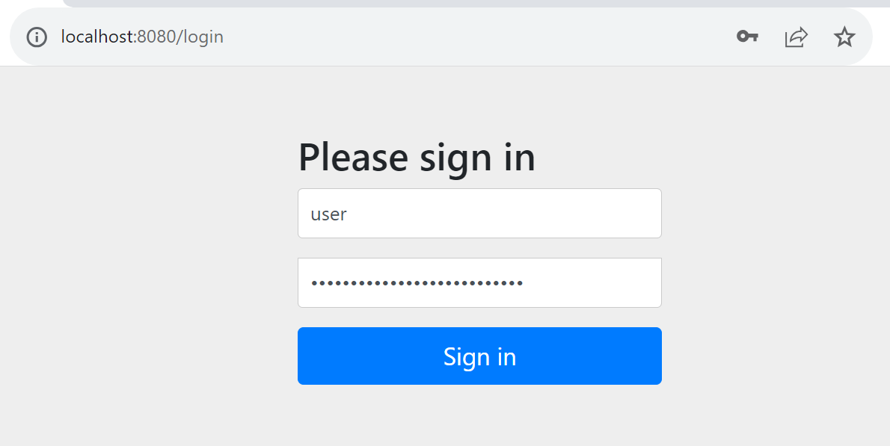
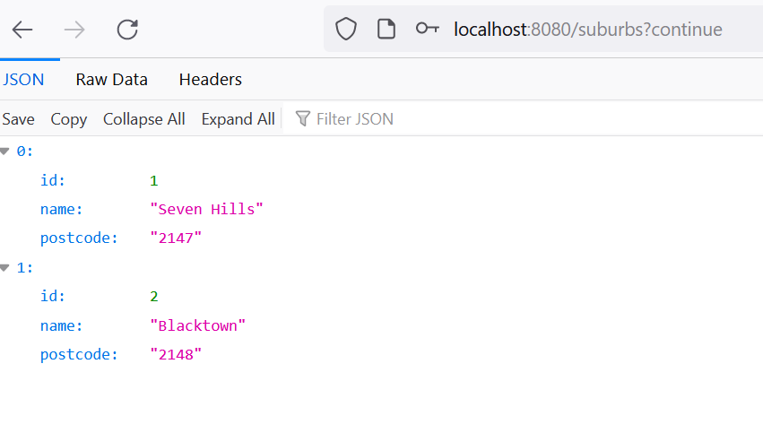
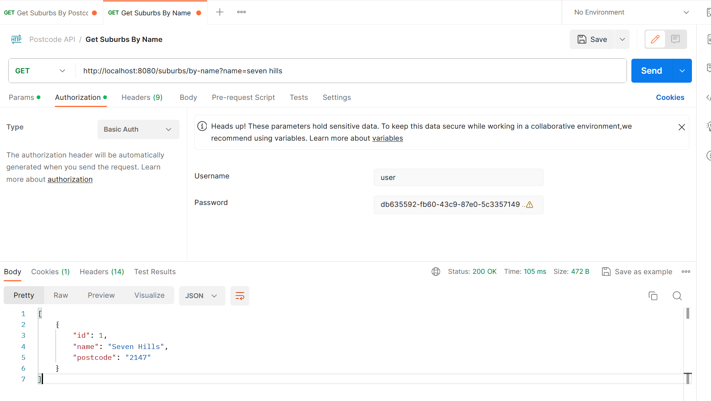

# Postcode-API

## **Table of Contents** 

  - [**Table of Contents**](#table-of-contents)
  - [**Description**](#description)
  - [**My experience**](#my-experience)
  - [**Usage**](#usage)
  - [**Technologies Used**](#technologies-used)
  - [**Preview**](#preview)
  - [**Deployed link**](#deployed-link)
  - [**Future Development**](#future-development)
  - [**Questions**](#questions)
  - [**Building Natively**](#building-natively)


## **Description**

**Frontend is build and the application is deployed.**

This project was designed to create an API in Java that allows mobile clients to retrieve and add suburb and postcode combinations.
This API that allows mobile clients to retrieve the suburb information by postcode.
This API that allows mobile clients to retrieve a postcode given a suburb name.
A secured API to add new suburb and postcode combinations 
  
## **My experience**

I found this project a good opportunity to continuing practising the Spring framework and the backend testing using the Spring boot testing. 

A new tool that this project provided me was how to create new methods inside the repository interface to use them in the service layer and being able to implement these methods by finding a suburb with a query parameter such as name or postcode.

To make this application secured and being able to get access to each endpoint I implemented the Basic Spring Authentication. 
This implementation provides a password in the console that I could use inside Postman or the login page that Spring provides with the URL: http://localhost:8080/login.




## **Usage**
```
Using Eclipse, IntelliJ or a bash terminal/console, run/execute the Main class. 
```

## **Technologies Used**

* Java
* Spring
* Spring Boot Test
* Postman

## **Preview**

* **Get a Suburb by name**



* **Get a Suburb by postcode**


## **Deployed link**

💡 Live version: [Click here!](https://postcode-search.apps.marcelamejia.xyz/)

## **Future Development**

* Build a frontend with React.

## **Questions**

* Contact me on my GitHub profile: [Marcela's GitHub](https://github.com/marcelamejiao)

## **Building Natively**

To build the docker image for a native Java binary run:

```shell
./mvnw -Pnative spring-boot:build-image
```
